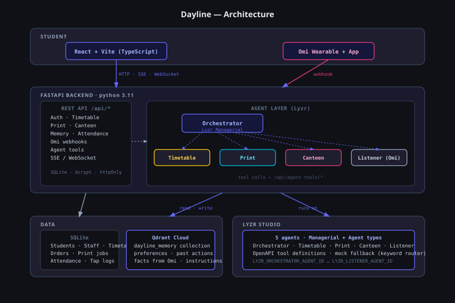

# Dayline

> **Stop waiting in queues. Let your agents handle it.**

Dayline is a voice-first, memory-backed campus assistant where three AI agents — Timetable, Print and Canteen — plan your day around your actual schedule. Ask once, by voice or text, and they figure out when your next class is, queue your printout to be ready before it, and order your lunch for the right break. No separate apps. No manual juggling.

Built for the HiDevs hackathon: **Stop Prompting. Code Solo Agents.**

[](https://dayline-4lxb.onrender.com)
[](LICENSE)

---

## The problem

Every engineering student in India loses time to three things every single day:

**The print queue.** A lab starts in 20 minutes. The print shop has 15 people ahead of you. You skip lunch to get the record ready. There is no way to submit ahead, no way to know when it will be done.

**The canteen queue.** You order, then wait while it is cooked. Canteen staff cook blind — they do not know how much to make until people show up. Leftover food gets thrown away.

**Attendance arithmetic.** You want to bunk one class. You do not know if you can afford it. You open a spreadsheet and calculate. Or you guess and regret it.

These are not three separate problems. They are one. Everything is connected to your timetable, and right now nothing talks to anything else.

---

## The solution

Dayline connects these three problems through a **multi-agent execution loop** built on Lyzr, Qdrant and Omi.

One request — typed, spoken on the phone, or said aloud to an Omi wearable — is handled by an orchestrator that delegates to three specialised sub-agents. The Timetable agent checks your next class. The Print agent sets the deadline from that. The Canteen agent sets the pickup time from your next free slot. They share a **vector memory in Qdrant** so each one knows what the others have learned about you.

The result drops onto your day as a timeline of coloured passes. When you walk to the canteen or the print shop, you tap your ID card barcode and the order is marked collected — no token, no queue.

---

## Architecture



```
┌─────────────────────────────────────────────────────────────────┐
│                        Student                                  │
│          Web app (React + Vite)  ·  Omi wearable               │
└────────────┬──────────────────────────────┬────────────────────┘
             │ HTTP / SSE / WebSocket        │ Webhook
             ▼                              ▼
┌─────────────────────────────────────────────────────────────────┐
│                   FastAPI backend                               │
│                                                                 │
│  ┌─────────────┐   ┌──────────────────────────────────────┐     │
│  │  REST API   │   │         Agent layer                  │     │
│  │  /api/*     │   │                                      │     │
│  │             │   │  Orchestrator (Lyzr Managerial)      │     │
│  │  Auth       │   │       │          │          │        │     │
│  │  Timetable  │   │  Timetable   Print      Canteen      │     │
│  │  Print      │   │   agent      agent       agent       │     │
│  │  Canteen    │   │       │          │          │        │     │
│  │  Tap/Scan   │   │       └──────────┴──────────┘        │     │
│  │  Memory     │   │              tool calls              │     │
│  │  Omi hooks  │   │         /api/agent-tools/*           │     │
│  └──────┬──────┘   └──────────────────────────────────────┘     │
│         │                        │                              │
└─────────┼────────────────────────┼──────────────────────────────┘
          │                        │
          ▼                        ▼
  ┌───────────────┐      ┌─────────────────┐
  │  SQLite DB    │      │  Qdrant Cloud   │
  │               │      │                 │
  │  Students     │      │  dayline_memory │
  │  Timetable    │      │  collection     │
  │  Attendance   │      │                 │
  │  Orders       │      │  preferences    │
  │  Print jobs   │      │  past actions   │
  │  Tap logs     │      │  facts from Omi │
  │  Memory refs  │      │  instructions   │
  └───────────────┘      └─────────────────┘
```

### How the agents collaborate

```
Student: "Get me lunch and print my lab record before my next class"
         │
         ▼
  Orchestrator (Lyzr)
         │
         ├──► Timetable agent
         │         reads: today's schedule
         │         returns: next class = DBMS lab at 2:00, free slot = 12:40
         │         writes to Qdrant: "user checked timetable Mon 12:20"
         │
         ├──► Print agent
         │         reads: Qdrant memory ("last time: 2 copies, B&W, double-sided")
         │         uses: next class time from Timetable agent
         │         returns: proposal — P-0042, ready by 1:50, ₹48
         │         writes to Qdrant: "proposed print job Mon 12:22"
         │
         └──► Canteen agent
                   reads: Qdrant memory ("usual Monday lunch: veg fried rice")
                   uses: free slot from Timetable agent
                   returns: proposal — Token 16, pickup 12:40, ₹60
                   writes to Qdrant: "proposed canteen order Mon 12:22"
         │
         ▼
  Orchestrator returns two confirm cards to the student.
  Nothing is ordered until the student presses "Confirm and pay".
```

---

## How Dayline uses each sponsor tool

### Omi

Omi is the hands-free entry point. Dayline registers two webhooks:

- **`POST /api/omi/transcript`** — receives live transcript segments. When the wake phrase "hey dayline" is detected, the words after it are sent to the orchestrator in voice mode. The reply is sent back through Omi's notification API as a short spoken response.
- **`POST /api/omi/memory`** — receives a finished conversation summary. The Listener agent (Lyzr) extracts up to five items that matter to Dayline: deadlines, things to print, food preferences, timetable changes. These are stored in Qdrant tagged `written_by = omi`. A nudge appears on the student's day if the item is actionable.

Without an Omi device, the **Omi simulator** in the app drives both code paths from the browser.

### Qdrant

Qdrant is the shared vector memory. Every agent reads and writes to one collection: `dayline_memory`.

- **Reads:** before each orchestrator run, the top five memories relevant to the message are retrieved and injected as context. Sub-agents call `recall(query)` from their tool set.
- **Writes:** after each confirmed action, from Omi conversations, and when the student says "remember that…". Each entry carries who wrote it (`written_by`), what kind it is (`preference`, `action`, `fact`, `instruction`) and when it was last used.
- **Isolation:** every query and delete is filtered by `student_id` on the server. A test in the suite proves student A cannot retrieve student B's memory.

Visible effect: "Order my usual" resolves from past orders. "Print it like last time" reuses saved settings. A fact captured by Omi ("lab record due Thursday") sets the print agent's deadline.

### Lyzr

Lyzr runs the orchestrator and all sub-agents. The architecture uses Lyzr's Managerial agent type, where the Orchestrator delegates to sub-agents, and custom tools registered from the backend's OpenAPI description.

- **Agents:** Orchestrator, Timetable, Print, Canteen, Listener (5 total, within the free plan's limit of 10).
- **Tools:** each sub-agent calls `/api/agent-tools/*` endpoints. These are thin wrappers over the same service functions the REST API uses. A short-lived `run_token` maps each tool call to the student and conversation; the model never supplies a student id.
- **Streaming:** agent activity streams to the frontend over SSE as `agent_started`, `tool_called`, `memory_read`, `memory_write` and `final` events. The student watches each agent light up in turn.
- **Fallback:** if Lyzr is unreachable or times out (20 seconds), a keyword router handles the request and the trace says so. The app never crashes.

---

## Key features

| Feature | How it works |
| --- | --- |
| Multi-agent chat | Lyzr Managerial orchestrator delegates to three specialised sub-agents |
| Voice input | Hold to talk in the browser; Omi wearable for ambient capture |
| Shared memory | Qdrant vector store, one collection, all agents read and write |
| Timeline view | The student's day as a strip; orders and print jobs appear as ticket-shaped passes |
| Print ahead | Upload a PDF; the deadline is set from your next class automatically |
| Canteen pre-order | Order before you leave class; collect by tapping your ID barcode |
| Attendance maths | How many classes you can miss, or must attend, stated plainly |
| Standing instructions | "Order my usual lunch on lab days, up to ₹80" — agents act within your limit, notify you, and you can undo within five minutes |
| Omi simulator | Drives both Omi webhooks from the browser; no device needed |
| Demo mode | Fixed demo clock, one-click reset, demo accounts on the login screen |

---

## Tech stack

| Layer | Technology |
| --- | --- |
| Frontend | React 18, Vite, TypeScript, Tailwind CSS, shadcn/ui, Framer Motion, TanStack Query |
| Backend | Python 3.11, FastAPI, SQLModel, SQLite, Uvicorn |
| Agents | Lyzr Agent Studio (Managerial + Agent types) |
| Memory | Qdrant Cloud (free tier), FastEmbed for local embeddings |
| Voice wearable | Omi by Based Hardware |
| Realtime | WebSocket (FastAPI), Server-Sent Events for agent trace |
| Auth | httpOnly session cookie, bcrypt PIN hashing |
| Deployment | Docker, [hosting provider] |

---

## Repository layout

```
dayline/
  backend/
    app/
      main.py              # App entry, CORS, routers, WebSocket
      config.py            # Env settings
      clock.py             # Clock service (real + demo override)
      db.py                # Engine, session
      models.py            # SQLModel tables
      auth.py              # Login, session, role guards
      routers/             # timetable, attendance, print, canteen,
      │                    # tap, agent, agent_tools, omi, admin, today
      services/            # Business logic, one module per domain
      agents/
        llm.py             # LLM client interface
        orchestrator.py    # Lyzr managerial agent caller
        timetable_agent.py
        print_agent.py
        canteen_agent.py
        listener_agent.py  # Omi memory extraction
        tools.py           # Tool schemas → service functions
        prompts/           # System prompts as .md files
        mock_router.py     # Keyword fallback, no API key needed
      events.py            # WebSocket broadcast
      seed.py              # Sample data
    tests/                 # pytest suite
    uploads/               # Print files (git-ignored)
    .env.example
    requirements.txt
    Dockerfile
  frontend/
    src/
      app/                 # Routes, layouts
      components/          # UI primitives, feature components
      features/            # today, ask, print, canteen,
      │                    # attendance, memory, staff, admin, omi-sim
      lib/                 # API client, WebSocket hook, formatters
      styles/              # Design tokens, globals
  scripts/
    setup_lyzr.py          # Creates / updates Lyzr agents idempotently
  README.md
  DAYLINE_SPEC.md
  DAYLINE_ADDENDUM_V2.md
```

---

## Getting started

### Prerequisites

- Python 3.11 or later
- Node.js 20 or later
- A [Qdrant Cloud](https://cloud.qdrant.io) free-tier cluster
- A [Lyzr Studio](https://studio.lyzr.ai) free account
- (Optional) Omi app and wearable for real voice capture

### 1. Clone and configure

```bash
git clone https://github.com/bbsarada07/dayline.git
cd dayline
cp backend/.env.example backend/.env
```

Edit `backend/.env`:

```env
PUBLIC_BASE_URL=http://localhost:8000
AGENT_MODE=mock                        # mock | lyzr
LYZR_API_KEY=
LYZR_ORCHESTRATOR_AGENT_ID=
LYZR_TIMETABLE_AGENT_ID=
LYZR_PRINT_AGENT_ID=
LYZR_CANTEEN_AGENT_ID=
LYZR_LISTENER_AGENT_ID=
QDRANT_URL=https://xxx.cloud.qdrant.io
QDRANT_API_KEY=
OMI_APP_ID=
OMI_APP_SECRET=
TOOL_KEY=changeme
DEMO_MODE=true
```

### 2. Backend

```bash
cd backend
python -m venv .venv
source .venv/bin/activate          # Windows: .venv\Scripts\activate
pip install -r requirements.txt
python -m app.seed                 # Load sample data
uvicorn app.main:app --reload
```

Backend runs on `http://localhost:8000`. On start it prints the LAN address so your phone can reach it on the same hotspot.

### 3. Frontend

```bash
cd frontend
npm install
npm run dev
```

Frontend runs on `http://localhost:5173`. Vite proxies `/api` and `/ws` to the backend.

### 4. Set up Lyzr agents (skip in mock mode)

```bash
cd scripts
python setup_lyzr.py
```

This creates or updates the five agents idempotently and prints their IDs. Copy them into `.env`.

### 5. Connect Omi (optional)

Once the backend is deployed and `PUBLIC_BASE_URL` is set:

1. Open the app, log in as a student, go to **Profile → Connect Omi**.
2. Copy the two webhook URLs shown there.
3. Open the Omi app → Developer → paste each URL.

Without a device, the Omi simulator in the app drives both webhook paths from the browser.

---

## Demo accounts

Set `DEMO_MODE=true` in `.env`. All PINs are `1234`.

| Role | Username / Roll no | What to do |
| --- | --- | --- |
| Student | [roll number from seed] | Ask agents, order, print, check memory |
| Canteen staff | canteen | See orders arrive, mark ready |
| Print shop | print | See print jobs, mark ready |
| Admin | admin | Settings, card enrolment |

---

## Running tests

```bash
cd backend
pytest tests/ -v
```

The suite covers attendance maths, print cost and queue ordering, token numbering, stock under concurrent orders, every tap/scan status and permission checks.

---

## Demo script

See [`docs/demo-script.md`](docs/demo-script.md) for the full five-minute walkthrough used in the submission video.

The fastest path to see all three agents collaborate:

1. Log in as a student.
2. Attach a PDF to the ask bar and type: *Get me lunch and print this before my next class.*
3. Watch Timetable, Print and Canteen light up in turn.
4. Confirm both proposals.
5. In a second window, log in as canteen, mark the order ready, and use **Simulate scan**.
6. Back as the student, the pass is stamped **Collected** and the memory entry appears.

---

## Known limits

- **Payments are demo-only.** No real money moves. A `upi` provider stub is in the codebase for a real integration.
- **Attendance data is seeded.** The app cannot connect to the college's actual attendance system without an API from the institution.
- **Qdrant free tier:** 1 GB RAM, 4 GB disk, single node. Sufficient for a demo; needs an upgrade for production use.
- **Lyzr free tier:** 20 credits total. The app uses `AGENT_MODE=mock` by default and switches to Lyzr only when explicitly configured.
- **SQLite** is used for simplicity. Swap for PostgreSQL for production.
- **Print files** are deleted from disk on collection or expiry. They are not persisted across server restarts on free-tier hosting.

---

## Acknowledgements

Built with [Lyzr Agent Studio](https://studio.lyzr.ai), [Qdrant](https://qdrant.tech) and [Omi](https://www.omi.me) as part of the HiDevs hackathon: Stop Prompting. Code Solo Agents.
